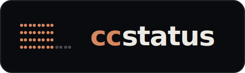
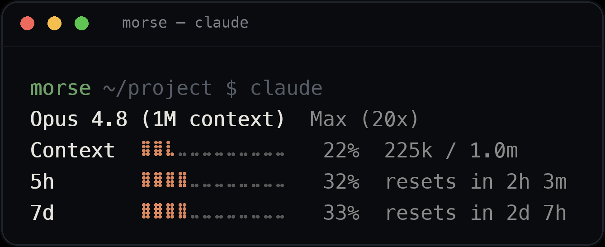
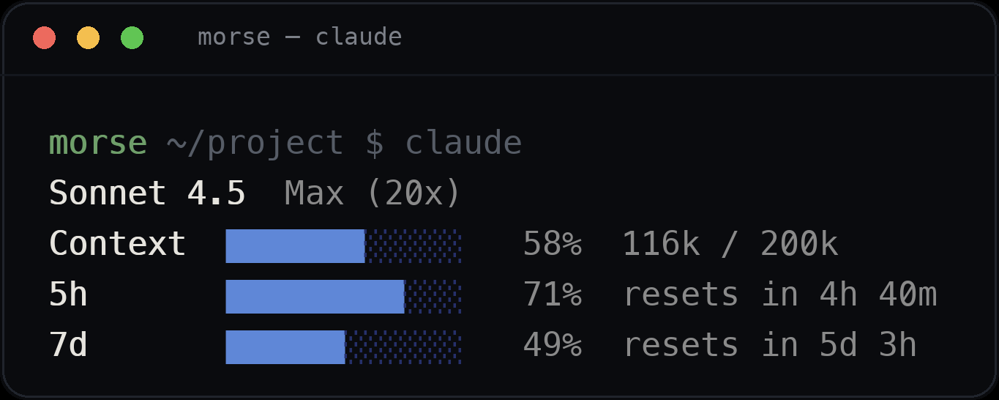

<p align="center">
  
</p>

<p align="center">
  <strong>Fast Claude Code status line with cached usage bars.</strong><br>
  Model, context window, and both rate-limit windows as hi-res braille gauges —
  with last-known usage shown <em>instantly</em> on session start instead of blanks.
</p>

<p align="center">
  <a href="https://crates.io/crates/ccstatus"></a>
  <a href="https://www.npmjs.com/package/ccstatus-cli"></a>
  <a href="https://github.com/morsechimwai/claude-status-line/releases"></a>
  <a href="LICENSE"></a>
  <a href="https://claude-status-line-ten.vercel.app"></a>
</p>

<p align="center"></p>

<p align="center"><a href="https://claude-status-line-ten.vercel.app">claude-status-line-ten.vercel.app</a></p>

---

Single Rust binary, no runtime dependencies. Each row shows a usage percent and a
hi-res **braille bar** in the Claude-brand color. The context row adds the
input/output token split; the two **rate-limit windows** (5-hour and 7-day) count
down to their reset. The **plan label** (e.g. `Max (20x)`) sits next to the model,
auto-detected from your Claude Code account.

## Features

- **Cold-start cache** — Claude Code only knows your usage *after* its first API
  call, so a fresh session would show `--`. ccstatus writes last-known usage to
  disk and reads it back instantly on cold start. Live data always overrides it.
- **Hi-res braille bars** — twice the horizontal resolution of block bars. Switch
  to solid **block bars** with one config key.
- **Color presets** — `orange` (default, Claude brand), `blue`, `green`, `purple`,
  `mono` — or override individual 256-color indices.
- **Plan auto-detection** — reads *only* the rate-limit tier field from
  `~/.claude.json` and maps it to a short label. No network, no auth.
- **Fully configurable** — colors, bar style, labels, the plan label, and which
  rows show are all optional keys in one TOML file.
- **Fast & tiny** — release binary is LTO'd and stripped; startup is sub-millisecond.

## Install

**Homebrew** (macOS / Linux)

```bash
brew install morsechimwai/tap/ccstatus
```

**npm / pnpm / yarn / bun** — downloads the prebuilt binary for your platform

```bash
npm  install -g ccstatus-cli
pnpm add     -g ccstatus-cli
```

**Cargo** — builds from source

```bash
cargo install ccstatus
```

Or grab a prebuilt binary from the
[Releases](https://github.com/morsechimwai/claude-status-line/releases) page and
put it on your `PATH`.

> The Homebrew and Cargo installs are pure native binaries. The npm package wraps
> the same binary in a thin Node launcher (~tens of ms startup) for people who
> prefer the npm toolchain.

## Set up Claude Code

Add the `statusLine` key to `~/.claude/settings.json`:

```json
{
  "statusLine": { "type": "command", "command": "ccstatus", "padding": 1 }
}
```

Start a new session — the status line appears at the bottom of Claude Code.

## Configuration

Everything is optional. Copy the example and edit only what you want; omitted keys
fall back to the defaults that reproduce the look above.

```bash
mkdir -p ~/.config/ccstatus
cp config.example.toml ~/.config/ccstatus/config.toml
```

| Section    | Key            | Default     | What it does                                              |
|------------|----------------|-------------|-----------------------------------------------------------|
| `[colors]` | `preset`       | `"orange"`  | `orange` · `blue` · `green` · `purple` · `mono`           |
| `[colors]` | `fill`         | *(preset)*  | 256-color index for filled bar cells                      |
| `[colors]` | `track`        | *(preset)*  | 256-color index for the empty track                       |
| `[colors]` | `dim`          | *(preset)*  | 256-color index for percent / value / plan text           |
| `[bar]`    | `width`        | `12`        | bar width in cells                                        |
| `[bar]`    | `braille`      | `true`      | hi-res braille dots; `false` for a solid block bar        |
| `[bar]`    | `filled`       | `"█"`       | block-mode filled glyph (block bar only)                  |
| `[bar]`    | `empty`        | `"░"`       | block-mode empty glyph (block bar only)                   |
| `[rows]`   | `context`      | `true`      | show the context-window row                               |
| `[rows]`   | `current`      | `true`      | show the 5-hour window                                    |
| `[rows]`   | `weekly`       | `true`      | show the 7-day window                                     |
| `[layout]` | `model_header` | `true`      | show the model name on its own line                       |
| `[layout]` | `plan`         | `""`        | override the plan label, e.g. `"Max (20x)"`               |
| `[layout]` | `plan_auto`    | `true`      | auto-detect plan from `~/.claude.json`; `false` disables  |
| `[labels]` | `context`      | `"Context"` | row label text                                            |
| `[labels]` | `current`      | `"5h"`      | row label text                                            |
| `[labels]` | `weekly`       | `"7d"`      | row label text                                            |

See [`config.example.toml`](config.example.toml) for the annotated version.

**Example — `blue` preset with block bars and a shorter layout:**

```toml
[colors]
preset  = "blue"
[bar]
braille = false
```

<p align="center"></p>

## How the cache works

Claude Code only reports your rate-limit usage after its first API call of a
session, so a fresh window would otherwise render `--`. ccstatus writes the
last-known usage to `~/.cache/ccstatus/usage.json` and reads it back on cold
start — **no network calls, no auth**. Live data always overrides the cache and
refreshes it, so what you see is at worst one session stale, never blank.

## How plan detection works

The status-line JSON that Claude Code pipes to ccstatus doesn't carry your plan.
To fill in the plan label, ccstatus reads *only* the rate-limit tier field from
`~/.claude.json` and maps it to a short label (e.g. `Max (20x)`). Override it with
`[layout] plan = "…"`, or turn it off entirely with `plan_auto = false`.

> Per-model ("Fable") limits aren't exposed anywhere in the status-line data, so
> only the aggregate 5-hour and 7-day windows are shown.

## Building from source

```bash
git clone https://github.com/morsechimwai/claude-status-line
cd claude-status-line
cargo build --release      # binary at target/release/ccstatus
cargo test                 # integration tests in tests/cli.rs
```

The status line reads the Claude Code status JSON on stdin, so you can preview any
state without a live session:

```bash
echo '{"model":{"display_name":"Opus 4.8"},
  "context_window":{"used_percentage":22,"context_window_size":1000000,
    "total_input_tokens":180000,"total_output_tokens":45000},
  "rate_limits":{"five_hour":{"used_percentage":32,"resets_at":4102444800},
    "seven_day":{"used_percentage":33,"resets_at":4102444800}}}' \
  | target/release/ccstatus
```

The screenshots in this README are generated from real binary output by
[`scripts/gen-screenshot.py`](scripts/gen-screenshot.py); the logo by
[`scripts/gen-logo.py`](scripts/gen-logo.py).

## License

[MIT](LICENSE) © morsechimwai
