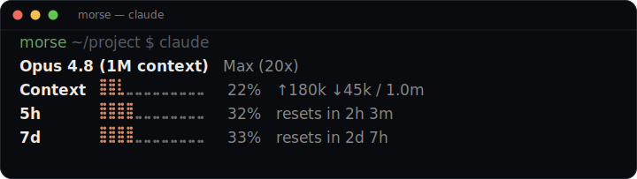

# ccstatus

Fast Claude Code status line with usage bars. Renders the model, your context
window, and both rate-limit windows (5-hour and 7-day) as hi-res braille gauges,
with **cached last-known usage shown instantly on session start** instead of blanks.

**Site:** https://claude-status-line-ten.vercel.app

Single Rust binary, no runtime dependencies.

<p align="center"></p>

Each row shows usage percent and a hi-res braille bar in the Claude-brand color
(orange by default; pick a `blue`/`green`/`purple`/`mono` preset or any 256-color
in config). The context row adds the input/output token split, and the rate-limit
rows count down to their reset. The plan label (e.g. `Max (20x)`) sits next to the
model — auto-detected from your Claude Code account. Colors, the braille/block bar,
labels, the plan label, and which rows show are all configurable — see
[`config.example.toml`](config.example.toml).

> **Plan auto-detection:** the status-line JSON doesn't carry your plan, so
> ccstatus reads *only* the rate-limit tier field from `~/.claude.json` and maps
> it to a short label. Override it with `[layout] plan = "…"`, or turn it off
> with `plan_auto = false`. Per-model ("Fable") limits aren't exposed anywhere in
> the status-line data, so only the aggregate 5-hour and 7-day windows are shown.

## Install

**Homebrew** (macOS / Linux):

```bash
brew install morsechimwai/tap/ccstatus
```

**npm / pnpm / yarn / bun** (downloads the prebuilt binary for your platform):

```bash
npm  install -g ccstatus-cli
pnpm add     -g ccstatus-cli
```

**Cargo** (builds from source):

```bash
cargo install ccstatus
```

Or download a prebuilt binary from the [Releases](https://github.com/morsechimwai/claude-status-line/releases) page and put it on your `PATH`.

> The Homebrew and Cargo installs are pure native binaries. The npm package wraps
> the same binary in a thin Node launcher (~tens of ms startup) for people who
> prefer the npm toolchain.

## Configure Claude Code

Add to `~/.claude/settings.json`:

```json
"statusLine": { "type": "command", "command": "ccstatus", "padding": 1 }
```

## Configuration (optional)

Copy `config.example.toml` to `~/.config/ccstatus/config.toml` and edit. Every
key is optional and falls back to the defaults that reproduce the look above.

## How the cache works

Claude Code only knows your rate-limit usage after its first API call, so a
fresh session would otherwise show `--`. `ccstatus` writes the last-known
usage to `~/.cache/ccstatus/usage.json` and reads it back on cold start — no
network calls, no auth. Live data always overrides the cache and refreshes it.

## License

MIT
